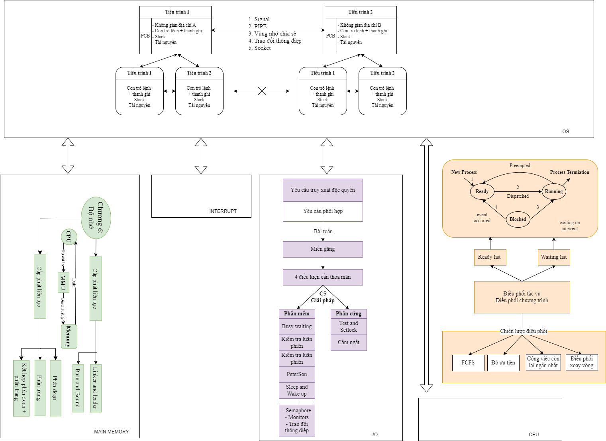
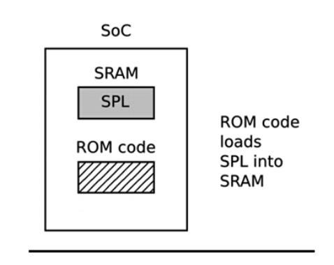
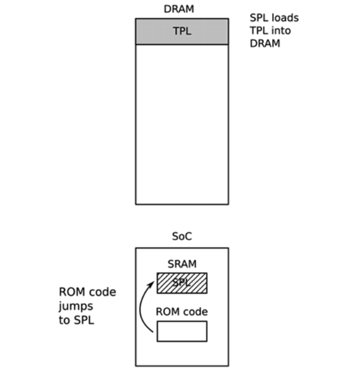
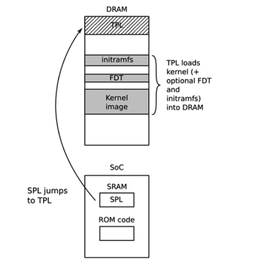

# Bài nhóm "làm tại lớp"

# Danh sách thành viên

| Họ và tên | MSSV | SĐT |
| --- | --- | --- |
| Nguyễn Thanh Phú | 22119211 | 0845939722 |
| Vũ Mai Liên | 22119194 | -- |
| Trần Xuân Mai | 22119196 | -- |
| Trần Thuỷ Tiên | 22119238 | -- |

---

# Tổng quan

Boot process



[https://drive.google.com/file/d/1RimGuc1xgAniTaAhWeuUrylkHQR6cDRP/view](https://drive.google.com/file/d/1RimGuc1xgAniTaAhWeuUrylkHQR6cDRP/view)

[https://youtu.be/j7WUEmPg_Qk](https://youtu.be/j7WUEmPg_Qk)

---

# **Quá trình khởi động của Vi điều khiển bare-metal (không hệ điều hành)**

### **1. Power ON / Reset**

- Khi **chip vừa được cấp nguồn (Power ON)** hoặc **nhấn nút Reset**, vi xử lý bắt đầu khởi động lại từ đầu.
- Lúc này, toàn bộ trạng thái trước đó bị xóa (giống như khởi động lại máy tính).

---

### **2. Fetch Reset_Handler từ Vector Table**

- **Vector Table** là một bảng chứa các địa chỉ hàm xử lý ngắt (interrupt handlers), được lưu ở một vùng nhớ cố định (thường là đầu flash).
- Mục thứ 2 trong bảng này là địa chỉ của **Reset_Handler**.
- CPU sẽ **"fetch" (lấy)** địa chỉ này và **nhảy tới Reset_Handler để bắt đầu thực thi**.

---

### **3. Khởi tạo bộ nhớ**

Đây là phần cực kỳ quan trọng để chuẩn bị RAM cho chương trình chạy:

- **.data**: là các biến toàn cục/biến static được khởi tạo. Chúng ban đầu nằm trong Flash, và cần được **copy từ Flash -> RAM** để có thể đọc/ghi.
- **.bss**: là các biến toàn cục/biến static không được khởi tạo giá trị ban đầu. Chúng cần được **zero hóa** (đặt về 0) trong RAM.

Việc này thường được viết trong Reset_Handler hoặc thư viện startup.

---

### **4. Cấu hình hệ thống (Clock, NVIC,...)**

- Cấu hình **Clock**: chọn nguồn xung nhịp (HSI, HSE, PLL...) để CPU hoạt động với tốc độ mong muốn.
- Cấu hình **NVIC (Nested Vectored Interrupt Controller)**: bật/tắt hoặc ưu tiên ngắt.
- Có thể cấu hình thêm các hệ thống khác như Flash latency, bus clock, v.v.

---

### **5. Gọi `main()`**

- Sau khi hệ thống đã sẵn sàng, **Reset_Handler sẽ gọi hàm `main()`** – đây là nơi chương trình chính bắt đầu.
- Đây là phần mà bạn thường viết code trong file `main.c`.

---

### **6. `while(1)`: vòng lặp chính**

- Đây là **vòng lặp vô tận**, chạy mãi cho đến khi có sự kiện khác xảy ra (ngắt, sleep, reset...).
- Trong hệ thống nhúng, chương trình thường chạy mãi trong vòng lặp chính này để:
    - Đọc cảm biến
    - Điều khiển thiết bị
    - Xử lý trạng thái
    - Giao tiếp với ngoại vi...
        
        [https://www.youtube.com/watch?v=Czd3MKdqfV8](https://www.youtube.com/watch?v=Czd3MKdqfV8)
        
        [https://drive.google.com/file/d/1RimGuc1xgAniTaAhWeuUrylkHQR6cDRP/view](https://drive.google.com/file/d/1RimGuc1xgAniTaAhWeuUrylkHQR6cDRP/view)
        

# **Quá trình khởi động Linux**

Quá trình khởi động bo gồm hai giai đoạn chính, giai đoạn khởi động của bootloader và giai đoạn khởi động của Kernel.

## Quá trình khởi động của bootloader

### Pha 1 - ROM Code

Ở giai đoạn này, CPU sẽ thực hiện các lệnh trong NOR Flash, để tải bộ khởi động cấp 2 SPL vào trong SRAM (DRAM vẫn chưa được khởi động).



### Pha 2 - Bộ khởi động thứ cấp SPL



CPU sẽ chuyển từ NOR Flash sang SRAM để thực thi các lệnh của SPL. SPL sẽ khởi tạo DRAM. Và tải TPL vào DRAM (toàn bộ Bootloader).

### Pha 3 - Bộ khởi tạo cấp 3 TPL



CPU chuyển từ SRAM sang DRAM để chạy TPL, lúc này TPL sẽ copy toàn bộ Kernel vào bên trong DRAM. Cuối pha này, Kernel đã sẵn sàng để chạy và chờ Bootloader nhường lại CPU.

### Giai đoạn Kernel

Ở giai đoạn này Bootloader sẽ chuyển điều khiển lại cho Kernel, một số thông tin được truyền lại:

- #number
- HW in4
- Kernel cmd line

Sau đó Kernel sẽ khởi chạy các ứng dụng tùy thuộc.

[https://www.youtube.com/watch?v=0uQbSB--fjY](https://www.youtube.com/watch?v=0uQbSB--fjY)

[https://drive.google.com/file/d/1OjcfCy0IiwG7c246HkeqMOcAqjZlwcRS/view](https://drive.google.com/file/d/1OjcfCy0IiwG7c246HkeqMOcAqjZlwcRS/view)

---

# Quy trình biên dịch 1 chương trình C

### **Bước 1: Tiền xử lý**

Bộ tiền xử lý thực hiện các hành động sau:

- Nó xóa tất cả các bình luận trong tệp nguồn.
- Nó bao gồm mã của tệp tiêu đề, là tệp có phần mở rộng .h chứa các khai báo hàm C và định nghĩa macro.
- Nó thay thế tất cả các macro (các đoạn mã đã được đặt tên) bằng giá trị của chúng.

Đầu ra của bước này sẽ được lưu trữ trong một tệp có phần mở rộng " **.i** ", do đó, nó sẽ nằm trong " **main.i** ".

Để dừng biên dịch ngay sau bước này, chúng ta có thể sử dụng tùy chọn " **-E** " với lệnh gcc trên tệp nguồn và nhấn Enter.

```
gcc -E main.c

```

### **Bước 2: Biên dịch**

Trình biên dịch tạo ra mã IR (Biểu diễn trung gian) từ tệp được xử lý trước, do đó, điều này sẽ tạo ra tệp " **.s** ". Tuy nhiên, các trình biên dịch khác có thể tạo ra mã lắp ráp ở bước biên dịch này.

Chúng ta có thể dừng sau bước này bằng tùy chọn " **-S** " trên lệnh gcc và nhấn Enter.

```
gcc -S main.c
```

Đây là giao diện của tệp **main.s** −

```
.file	"helloworld.c"
   .text
   .def	__main;	.scl	2;	.type	32;	.endef
   .section .rdata,"dr"
.LC0:
   .ascii "Hello, World! \0"
   .text
   .globl	main
   .def	main;	.scl	2;	.type	32;	.endef
   .seh_proc	main
main:
   pushq	%rbp
   .seh_pushreg	%rbp
   movq	%rsp, %rbp
   .seh_setframe	%rbp, 0
   subq	$32, %rsp
   .seh_stackalloc	32
   .seh_endprologue
   call	__main
   leaq	.LC0(%rip), %rcx
   call	puts
   movl	$0, %eax
   addq	$32, %rsp
   popq	%rbp
   ret
   .seh_endproc
   .ident	"GCC: (x86_64-posix-seh-rev0, Built by MinGW-W64 project) 8.1.0"
   .def	puts;	.scl	2;	.type	32;	.endef

```

### **Bước 3: Lắp ráp**

Trình biên dịch lấy mã IR và chuyển đổi nó thành mã đối tượng, tức là mã trong ngôn ngữ máy (tức là nhị phân). Điều này sẽ tạo ra một tệp có đuôi là ".o".

Chúng ta có thể dừng quá trình biên dịch sau bước này bằng cách sử dụng tùy chọn "-c" với lệnh gcc và nhấn Enter.

Lưu ý rằng tệp "main.o" không phải là tệp văn bản, do đó nội dung của tệp sẽ không thể đọc được khi bạn mở tệp này bằng trình soạn thảo văn bản.

### **Bước 4: Liên kết**

Trình liên kết tạo ra tệp thực thi cuối cùng, ở dạng nhị phân. Nó liên kết các mã đối tượng của tất cả các tệp nguồn với nhau. Trình liên kết biết tìm định nghĩa hàm ở đâu trong **các thư viện tĩnh** hoặc **thư viện động** .

Thư viện tĩnh là kết quả của trình liên kết tạo bản sao của tất cả các hàm thư viện được sử dụng vào tệp thực thi. Mã trong thư viện động không được sao chép hoàn toàn, chỉ có tên của thư viện được đặt trong tệp nhị phân.

Theo mặc định, sau bước thứ tư và cũng là bước cuối cùng này, tức là khi bạn gõ toàn bộ lệnh " **gcc main.c** " mà không có bất kỳ tùy chọn nào, trình biên dịch sẽ tạo một chương trình thực thi có tên là **main.out** (hoặc **main.exe** trong trường hợp Windows) mà chúng ta có thể chạy từ dòng lệnh.

Chúng ta cũng có thể chọn tạo một chương trình thực thi với tên mong muốn bằng cách thêm tùy chọn " **-o** " vào lệnh gcc, đặt sau tên của tệp hoặc các tệp chúng ta đang biên dịch.

```
gcc main.c -o hello.out
```

Vì vậy, bây giờ chúng ta có thể nhập " **./hello.out** " nếu bạn không sử dụng tùy chọn **"-o"** hoặc " **./hello** " để thực thi mã đã biên dịch. Đầu ra sẽ là " **Hello World** " và sau đó, dấu nhắc shell sẽ xuất hiện lại.

[https://drive.google.com/file/d/13W6_sugthVVj4ekpiI3WqPqwAzdi2-UW/view](https://drive.google.com/file/d/13W6_sugthVVj4ekpiI3WqPqwAzdi2-UW/view)

[https://www.youtube.com/watch?v=4XqD0o-h4Xs](https://www.youtube.com/watch?v=4XqD0o-h4Xs)

---

# **Mô tả các phân vùng**

- **Text segment (Code segment):**
    
    Chứa mã lệnh của chương trình – là vùng chỉ đọc (read-only) để tránh ghi nhầm gây lỗi.
    
- **Data segment:**
    
    Dành cho biến toàn cục hoặc biến tĩnh đã được khởi tạo giá trị trước khi chương trình chạy.
    
- **BSS segment:**
    
    Chứa các biến toàn cục hoặc biến tĩnh chưa khởi tạo (sẽ được hệ điều hành khởi tạo giá trị 0).
    
- **Heap:**
    
    Vùng bộ nhớ động do lập trình viên quản lý – thường được dùng với `malloc()`, `new`, v.v.
    
    Mở rộng lên trên khi cấp phát thêm bộ nhớ.
    
- **Stack:**
    
    Dành cho biến cục bộ, lưu thông tin lời gọi hàm, tham số, địa chỉ trả về, v.v.
    
    Mở rộng xuống dưới khi gọi hàm lồng nhau.
    
    [https://www.youtube.com/watch?v=LTDDHzLNgvo](https://www.youtube.com/watch?v=LTDDHzLNgvo)
    
    [https://drive.google.com/file/d/1m0aaLno1PaOkPpvC8ucXtTG7Sk1BVmya/view](https://drive.google.com/file/d/1m0aaLno1PaOkPpvC8ucXtTG7Sk1BVmya/view)