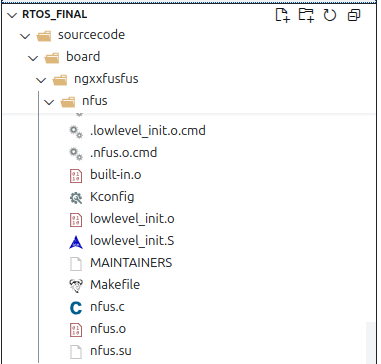
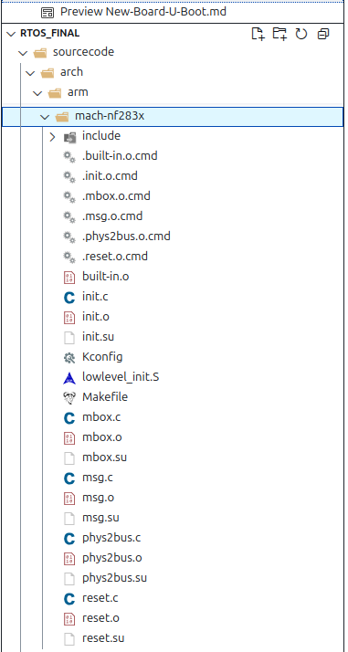
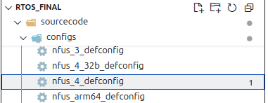
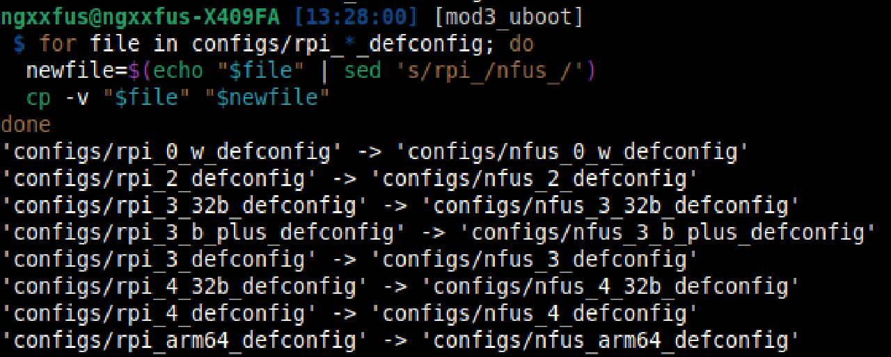
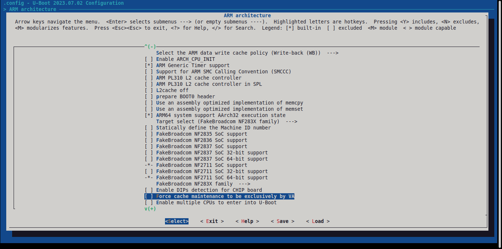
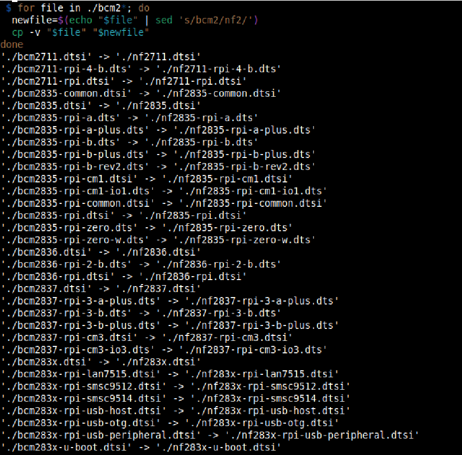
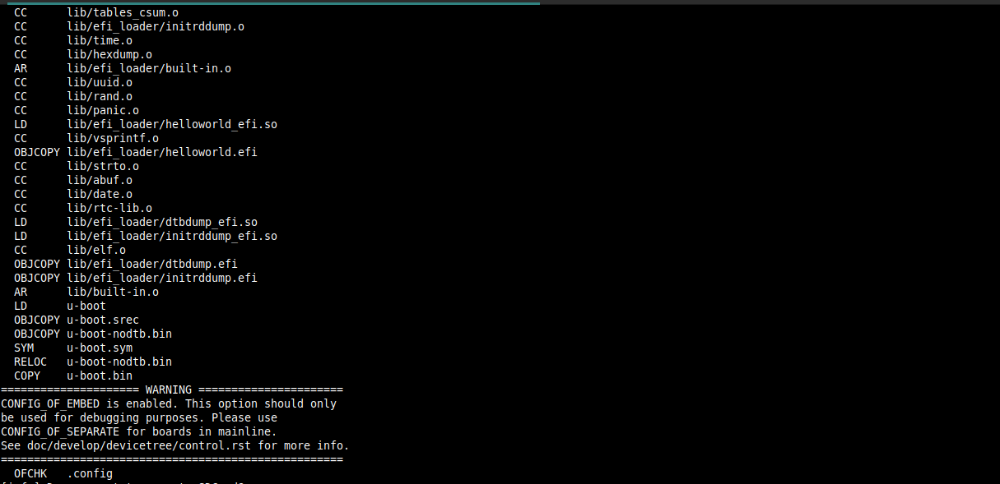

# Lời nói đầu

Quá trình triển khai U-Boot cho một board cụ thể với SoC cụ thể đòi hỏi số lượng lớn nhân lực thực hiện viết các thiết lập cho riêng SoC đó, để đơn giản hóa quá trình học, nhóm tác giả, giả định đang khiển khai U-Boot cho một bảng mạch giả tưởng, sử dụng SoC giả tưởng và của hãng giả tưởng. Nhiệm vụ chính của nhóm là sao chép và chỉnh sửa mã nguồn, các thiết lập có sẵn trong U-Boot cho bảng mạch RPi4-B+ thành các mã nguồn, thiết lập cho bảng mạch giả tưởng.

# Quy đổi / Giả định tên

Hiệu chỉnh tên:

	raspberrypi		→		ngxxfusfus
	raspberry 		→		ngxxfus
	broadcom		→		fakebroadcom
	brcm			→		nfs
	bcm			    →		nf
    rpi			    →		nfus
    RPi			    →		NFus

# Phương pháp sao chép mã nguồn

Các phương pháp được sử dụng để sao chép mã nguồn.

## MAINTAINERS

MAINTAINERS dùng để định nghĩa các thông tin người chịu trách nhiệm cho từng phần, trạng thái bảo trì, các tập tin được bảo trì. Dựa vào đó sẽ kiểm tra được các tập tin mã nguồn cần sao chép.

```Plaintext
    ARM BROADCOM BCM283X / BCM27XX
    M:    Matthias Brugger <mbrugger@suse.com>
    M:    Peter Robinson <pbrobinson@gmail.com>
    S:    Maintained
    F:    arch/arm/dts/bcm283*
    F:    arch/arm/mach-bcm283x/
    F:    board/raspberrypi/
    F:    drivers/gpio/bcm2835_gpio.c
    F:    drivers/mmc/bcm2835_sdhci.c
    F:    drivers/mmc/bcm2835_sdhost.c
    F:    drivers/serial/serial_bcm283x_mu.c
    F:    drivers/serial/serial_bcm283x_pl011.c
    F:    drivers/video/bcm2835.c
    F:    include/dm/platform_data/serial_bcm283x_mu.h
    F:    include/dt-bindings/pinctrl/bcm2835.h
    F:    drivers/pinctrl/broadcom/
    F:    configs/rpi_*
    T:    git https://source.denx.de/u-boot/custodians/u-boot-arm.git
```
## Built-Object

Các *.o là các file cần thiết, và chỉ được build khi cần thiết. Do đó kiểm tra các file được build sẽ giúp xác định các file nào quan trọng.

## KConfig / Makefile / Headers

KConfig giúp định nghĩa các config cần thiết. Trong khi đó Makefile, quyết định các file nào được biên dịch. Truy vết các file dựa theo tên và các header sẽ giúp tìm các file cần thiết.

# Sao chép chính xác

Các file .config, autoconf, ... là các file được tạo ra sau quá trình tổng hợp các config, từ đó biết được quá trình sao chép có đúng không. Ngoài ra các file dts được dịch ngược từ dtb, cũng được xem xét để so sánh.

# Quá trình thực hiện

## Tạo board mới



Sửa Makefile, Kconfig tương ứng với tên mới:
- uboot/arch/arm/Makefile
- uboot/arch/arm/dts/Makefile

## Tạo SoC mới



Sửa Makefile, Kconfig tương ứng với tên mới:

- uboot/arch/arm/mach-nf283x/init.c
- uboot/arch/arm/mach-nf283x/Makefile
- uboot/arch/arm/mach-nf283x/Kconfig
- uboot/arch/arm/Kconfig

## Tạo defconfig





Truy vết, hiệu chỉnh các file:

- uboot/drivers/net/Kconfig
- uboot/drivers/net/nfgenet.c
- uboot/drivers/net/Makefile



## Hiệu chỉnh / Sao chép các file liên quan

Hiệu chỉnh driver dựa vào Makefile:

- uboot/drivers/gpio/nf2835_gpio.c
- uboot/drivers/gpio/Makefile
- uboot/drivers/mmc/nf2835_sdhci.c
- uboot/drivers/mmc/nf2835_sdhost.c
- uboot/drivers/pinctrl/fakebroadcom/
- uboot/drivers/pinctrl/Makefile
- uboot/drivers/mmc/nf2835_sdhost.c
- uboot/drivers/serial/serial_nf283x_pl011.c
- uboot/drivers/serial/Makefile
- uboot/drivers/tee/fakebroadcom/
- uboot/drivers/tee/Makefile
- uboot/drivers/video/nf2835.c
- uboot/drivers/video/Makefile
- uboot/drivers/watchdog/nf2835_wdt.c
- uboot/drivers/watchdog/Kconfig
- uboot/drivers/watchdog/Makefile
- uboot/drivers/mmc/Kconfig
- uboot/drivers/pci/pcie_nfsstb.c
- uboot/lib/efi_loader/Kconfig
- uboot/arch/arm/cpu/armv8/Kconfig

Truy vết và sửa các file headers:

- uboot/include/dt-bindings/soc/nf2835-pm.h
- uboot/include/dt-bindings/clock/nf2835-aux.h
- uboot/include/dt-bindings/clock/nf2835.h
- uboot/include/dt-bindings/pinctrl/nf2835.h
- uboot/include/dm/platform_data/serial_nf283x_mu.h
- uboot/include/configs/nfus.h

## Sửa device tree

Sao chép các dts/dtsi cho board mới.



```dts
#include <dt-bindings/pinctrl/nf2835.h>
#include <dt-bindings/clock/nf2835.h>
#include <dt-bindings/clock/nf2835-aux.h>
#include <dt-bindings/gpio/gpio.h>
#include <dt-bindings/interrupt-controller/irq.h>
#include <dt-bindings/soc/nf2835-pm.h>

/* firmware-provided startup stubs live here, where the secondary CPUs are
 * spinning.
 */
/memreserve/ 0x00000000 0x00001000;

/* This include file covers the common peripherals and configuration between
 * nf2835 and nf2836 implementations, leaving the CPU configuration to
 * nf2835.dtsi and nf2836.dtsi.
 */

/ {
	compatible = "nfs,nf2835";
	model = "NF2835";
	#address-cells = <1>;
	#size-cells = <1>;

	aliases {
		serial0 = &uart0;
		serial1 = &uart1;
	};

	chosen {
		stdout-path = "serial0:115200n8";
	};

	rmem: reserved-memory {
		#address-cells = <1>;
		#size-cells = <1>;
		ranges;

		cma: linux,cma {
			compatible = "shared-dma-pool";
			size = <0x4000000>; /* 64MB */
			reusable;
			linux,cma-default;
		};
	};
    ...
```

**Giải thích**:

```/memreserve/ 0x00000000 0x00001000;```

Kernel sẽ không sử dụng vùng bộ nhớ từ 0x00000000 đến 0x00000FFF (4KB), thường là vùng bootcode hoặc vùng firmware giữ CPU khác ở chế độ chờ.

```
/ {
    compatible = "nfs,nf2835";
    model = "NF2835";
```

- Nút gốc /
- compatible: chuỗi định danh để kernel chọn đúng driver.
- model: mô tả bo mạch, thường dùng cho debug hoặc hiển thị.

```
/
├── compatible = "nfs,nf2835"
├── model = "NF2835"
├── #address-cells = <1>
├── #size-cells = <1>
│
├── aliases
│   ├── serial0 = &uart0
│   └── serial1 = &uart1
│
├── chosen
│   └── stdout-path = "serial0:115200n8"
│
└── rmem: reserved-memory
    ├── #address-cells = <1>
    ├── #size-cells = <1>
    ├── ranges
    │
    └── cma: linux,cma
        ├── compatible = "shared-dma-pool"
        ├── size = <0x4000000>   // 64MB
        ├── reusable
        └── linux,cma-default

```

# Build

```Zsh
#! /bin/zsh

source /mnt/sda1/Linux_Applications/shell_utils/colors.sh
source /mnt/sda1/Linux_Applications/shell_utils/functions.sh

clear;
# echo -e '\n\n\n\n\n\n\n\n\n\n\n\n'

print_info "[build] custom-uboot"


my_vendor=ngxxfus
my_board=nfus_4
# target=rpi_4_defconfig
target=nfus_4_defconfig

print_info "vendor: $my_vendor"
print_info "board: $my_board"
print_info "target: $target"

print_info "${LIGHT_BLUE} Clear old config/builds${NORM}"
make -j8 distclean   | tee .build.log ;
if [ $? -eq 0 ]; then :; else exit 1; fi

print_info "${LIGHT_BLUE} Make .config${NORM}"
make -j8 ARCH=arm CROSS_COMPILE=aarch64-linux-gnu-  $target   | tee -a .build.log ; 
if [ $? -eq 0 ]; then :; else exit 1; fi

print_info "${LIGHT_BLUE} Building... ${NORM}"
make -j8 ARCH=arm CROSS_COMPILE=aarch64-linux-gnu-    | tee -a .build.log ;
if [ $? -eq 0 ]; then :; else exit 1; fi


print_info "Do you want to copy to SDCard?"
if [ $? -eq 0 ]; then :; else exit 1; fi
copy2sdcard_flag=${yes_or_no}


print_info "${LIGHT_BLUE}Copy <dtb>${NORM}"
cp -rf arch/arm/dts/nf2711-nfus-4-b.dtb  /media/ngxxfus/3A05-A436/
if [ $? -eq 0 ]; then :; else exit 1; fi

print_info "${LIGHT_BLUE}Copy <u-boot>${NORM}"
cp -rf u-boot-nodtb.bin  /media/ngxxfus/3A05-A436/kernel8.img
if [ $? -eq 0 ]; then :; else exit 1; fi
```



# Kết quả

- Kiểm tra dts (truy ngược từ dtb), giống nhau tất cả, chỉ khác tên theo quy ước.
- Kiểm tra .config (được sinh tự động), kết quả thu được tương tự.
- Quá trình build thành công có lỗi.
- Quá trình boot thất bị (bị crashed) ở giai đoạn rất sớm.