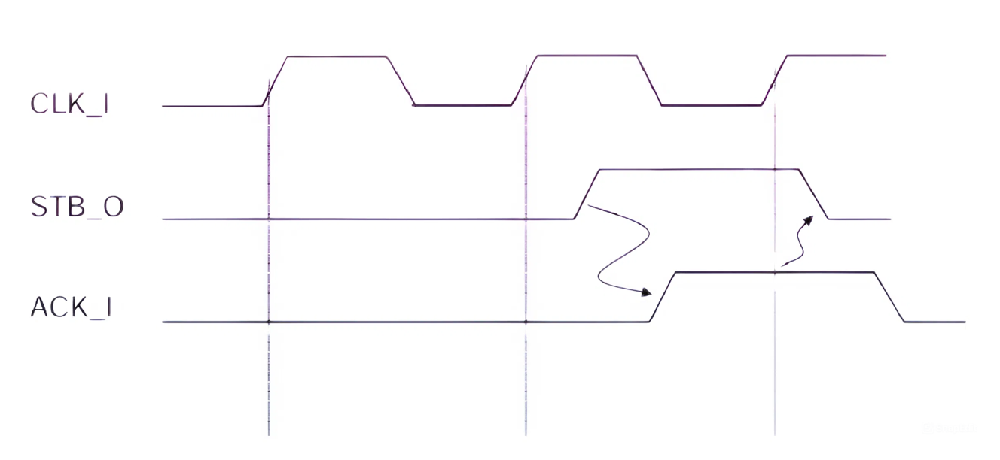

# Wishbone

# **1. Tổng quan**

Trong các hệ thống nhúng và SoC (System-on-Chip), nhu cầu trao đổi dữ liệu giữa các IP core là thiết yếu. Các hệ thống thời gian thực yêu cầu giao diện truyền dữ liệu phải chính xác, nhanh chóng và linh hoạt. Trong số đó, Wishbone được thiết kế như một chuẩn giao diện mở, cho phép các IP core giao tiếp với nhau dễ dàng, mà không phụ thuộc vào phần cứng cụ thể hay công cụ thiết kế của nhà sản xuất.

Wishbone đặc biệt phù hợp cho các hệ thống nhúng nhỏ, thiết kế trên FPGA và các dự án nghiên cứu học thuật, nhờ khả năng mô tả dễ dàng bằng ngôn ngữ HDL.

# **2. Cơ sở lý thuyết**

## **2.1. Giới thiệu**

WISHBONE là kiến trúc bus dành cho SoC, giúp kết nối các lõi IP từ nhiều nguồn khác nhau một cách hiệu quả và đơn giản.

Mục tiêu chính: chuẩn hóa giao tiếp giữa các IP core, hỗ trợ tái sử dụng và dễ tích hợp hệ thống.

Không chỉ là bus truyền dữ liệu, WISHBONE còn là phương pháp thiết kế giao tiếp chuẩn, giúp mỗi IP core hoạt động như mô-đun độc lập.

Phù hợp với các thiết kế mở, linh hoạt, không phụ thuộc bản quyền.

So với chuẩn AXI (dành cho SoC phức tạp), WISHBONE đơn giản hơn, không hỗ trợ các tính năng nâng cao như QoS hay burst không tuần tự.

## **2.2.Các đặc tính nổi bật của Wishbone**

Wishbone được thiết kế với mục tiêu đơn giản hóa tích hợp IP core trong SoC. Các đặc tính nổi bật gồm:

- Đơn giản, nhẹ
- Tính mô-đun cao
- Hỗ trợ nhiều kiểu truyền dữ liệu
- Giao thức truyền có kiểm soát
- Tính tương thích cao
- Giao thức truyền có kiểm soát
- Hỗ trợ đa Master.

## **2.3.Cơ chế bắt tay đồng bộ trong Wishbone**

Trong giao tiếp Wishbone, mọi hoạt động truyền dữ liệu đều tuân theo một cơ chế bắt tay đồng bộ (synchronous handshaking) giữa Master và Slave. Cơ chế này là xương sống của chuẩn Wishbone, giúp đảm bảo tính ổn định và tin cậy trong quá trình truyền nhận.

### **2.3.1. Giới thiệu**

Cơ chế bắt tay là một phương pháp phối hợp giữa các khối phần cứng sao cho dữ liệu chỉ được truyền đi khi cả hai bên – gửi và nhận – đều đã sẵn sàng.

Trong Wishbone, điều này được thực hiện nhờ các tín hiệu điều khiển như **STB_O**, **CYC_O** từ Master và **ACK_I** từ Slave.

Cơ chế hoạt động gồm 2 tín hiệu chính:

- **STB_O (Strobe Out)**: Master bật tín hiệu này để thông báo rằng có một giao dịch sẵn sàng (địa chỉ và dữ liệu đã hợp lệ).
- **ACK_I (Acknowledge In)**: Slave bật tín hiệu này để xác nhận rằng giao dịch đã được nhận và xử lý xong.

### **2.3.2. Cách hoạt động**

**Master** bắt đầu giao dịch bằng cách kích hoạt đồng thời hai tín hiệu:

- **CYC_O = 1**: báo hiệu đang trong một chu kỳ bus hợp lệ.
- **STB_O = 1**: yêu cầu truyền dữ liệu cụ thể (Strobe).

**Slave** khi đã sẵn sàng tiếp nhận yêu cầu sẽ phản hồi bằng tín hiệu **ACK_O = 1**.

**Master** nhận được **ACK_I = 1** thì xem như giao dịch đã hoàn tất. Khi đó, Master sẽ:

- Hạ **STB_O = 0** và/hoặc **CYC_O = 0** tùy trường hợp.
- Bắt đầu giao dịch mới hoặc giải phóng bus.

**Slave** cũng hạ **ACK_I** xuống sau đó.

---

Hình 1. Giao thức bắt tay Wishbone giữa Master và Slave

---

**Chú thích:**

**STB_O** (Strobe Out): Do Master phát ra, báo hiệu yêu cầu truy cập bus đã sẵn sàng.

**ACK_I** (Acknowledge In): Do Slave phát ra, xác nhận rằng nó đã xử lý yêu cầu.

**CLK_I**: Tín hiệu xung nhịp hệ thống.

**Giải thích:**

Hình trên mô tả Giao thức bắt tay Wishbone giữa Master và Slave:

1. Trước thời điểm **STB_O** lên mức 1

- Lúc này bus đang rảnh.
- **STB_O = 0, ACK_I = 0** → chưa có giao dịch nào xảy ra.

2. **STB_O** được bật lên *(ở cạnh lên của xung CLK thứ 2)*

- Master bắt đầu yêu cầu truy cập bus.
- **STB_O = 1** cho biết địa chỉ và dữ liệu đã được đặt lên bus và hợp lệ.
- Đây là yêu cầu bắt đầu giao dịch (có thể là đọc hoặc ghi).

3. Sau một vài chu kỳ, **ACK_I** được bật *(ở cạnh lên xung CLK tiếp theo)*

- Slave phát hiện yêu cầu và xử lý nó.
- Sau khi xử lý xong (ví dụ: đọc xong từ bộ nhớ), Slave trả về **ACK_I = 1** để xác nhận hoàn tất giao dịch.
- **Đây là sự đồng thuận giữa Master và Slave.**

4. **STB_O** được hạ xuống *(sau khi nhận* **ACK_I***)*

- Master thấy **ACK_I = 1** → biết rằng giao dịch đã xong, nên nó hạ **STB_O = 0**.
- Giao dịch kết thúc.

5. **ACK_I** cũng được hạ xuống

- Sau khi Master hạ **STB_O**, Slave cũng hạ **ACK_I**  → quay về trạng thái chờ yêu cầu mới.

### **2.3.3. Đặc điểm**

**Đồng bộ hóa hoàn toàn với xung CLK_I**: tất cả các tín hiệu bắt tay chỉ được kiểm tra và phản hồi tại cạnh lên của xung đồng hồ.

**Không cần bộ đệm tín hiệu phức tạp**: vì cả hai phía luôn phối hợp chính xác theo clock.

### **2.3.4. Vai trò của cơ chế bắt tay trong Wishbone**

**Đảm bảo dữ liệu hợp lệ**: Không có dữ liệu nào bị ghi hoặc đọc sai do sai lệch thời gian.

**Linh hoạt xử lý Wait State**: Slave có thể trì hoãn phản hồi nếu chưa sẵn sàng bằng cách không gửi ACK_O, giúp xử lý tốc độ chênh lệch giữa Master – Slave.

**Giảm lỗi hệ thống**: Giảm thiểu tình trạng “race condition” (tranh chấp logic) và lỗi đồng bộ khi truyền dữ liệu.

**Tối ưu tài nguyên phần cứng**: Không cần logic phức tạp kiểm tra trạng thái nội bộ như trong giao thức không đồng bộ.

# **3. Mô hình Wishbone trong SoC**

## **3.1.Các thành phần chính của Wishbone**

Kiến trúc Wishbone chủ yếu xoay quanh mô hình **MASTER – SLAVE**, do người thiết kế (System Integrator) điều phối và kết nối. Các thành phần cụ thể gồm:

| **Thành phần** | **Vai trò chính** | **Ý nghĩa** |
| --- | --- | --- |
| **SYSCON** | Bộ điều phối hệ thống – cung cấp xung đồng hồ (CLK_O) và tín hiệu reset (RST_O) cho toàn hệ thống. | Phát tín hiệu đồng hồ (CLK_O) và reset (RST_O). Đảm bảo đồng bộ toàn hệ thống. |
| **MASTER Interface** | IP core chủ động khởi tạo giao dịch bus, ví dụ như CPU hoặc DMA controller. | Sinh ra chu kỳ truy cập bus. Thường là CPU, DMA. |
| **SLAVE Interface** | IP core bị động, phản hồi yêu cầu từ Master, ví dụ như RAM, UART, GPIO. | Nhận chu kỳ và phản hồi. |
| **INTERCON (Interconnect Fabric)** | Thành phần trung gian kết nối nhiều Master và Slave với nhau, có thể là bus chia sẻ, switch hoặc crossbar. | Liên kết giữa Master và Slave. Có thể là bus chung, crossbar.. |
- **Lưu ý:** Master có thể là một vi xử lý, trong khi Slave có thể là một IP ngoại vi như SPI, LED, bộ nhớ,...

---

Hình 2. Module WISHBONE INTERCON.

---

**Giải thích:**

Hình trên mô tả mô hình kết nối điểm - điểm WISHBONE. Nó bao gồm một giao diện MASTER, một giao diện SLAVE và một khối SYSCON:

**SYS-CON (System Controller):**

- Cung cấp xung nhịp **(CLK_I)** và tín hiệu đặt lại hệ thống **(RST_I)**.
- Vai trò: Đồng bộ hóa toàn bộ hoạt động giữa Master và Slave, đảm bảo các mô-đun làm việc theo cùng một chu kỳ đồng hồ.

**WISHBONE MASTER:**

- Là thành phần khởi tạo chu kỳ truyền dữ liệu.
- Thường là các khối như CPU, DMA Controller hoặc bất kỳ IP nào cần truy cập đến thiết bị ngoại vi hoặc bộ nhớ.
- Gửi các tín hiệu điều khiển như **ADR_O, DAT_O, STB_O, CYC_O, WE_O** và nhận phản hồi từ Slave thông qua **ACK_I, DAT_I**,...

**WISHBONE SLAVE:**

- Là thành phần phản hồi các yêu cầu từ Master.
- Có thể là bộ nhớ, bộ điều khiển thiết bị ngoại vi (như UART, GPIO...), hoặc các IP core khác.
- Nhận các tín hiệu địa chỉ, dữ liệu, điều khiển và phản hồi dữ liệu hoặc xác nhận hoàn thành chu kỳ thông qua ACK_O, DAT_O.

**INTERCON (Interconnection Block):**

- Là phần kết nối các tín hiệu giữa Master và Slave, thực hiện định tuyến giữa các chân tương ứng theo đúng chuẩn Wishbone.
- Với mô hình Point-to-Point, INTERCON đơn giản chỉ là các dây nối trực tiếp (không cần arbitration hay bus controller).

**Đặc điểm:**

- Tất cả các tín hiệu Wishbone hoạt động theo cạnh lên của xung Clock (CLK_I).
- Tín hiệu điều khiển và dữ liệu có logic tích cực mức cao, tức là mức logic '1' được coi là tín hiệu có hiệu lực.
- Thiết kế này giúp chuẩn Wishbone dễ tích hợp với các hệ thống đồng bộ, giảm lỗi giao tiếp và tăng khả năng tái sử dụng IP core.

## **3.2. Các mô hình kết nối chính trong Wishbone**

Wishbone hỗ trợ nhiều mô hình kết nối linh hoạt, mỗi mô hình phù hợp với từng quy mô hệ thống khác nhau. Việc lựa chọn mô hình kết nối giúp tối ưu hiệu suất, độ phức tạp và khả năng mở rộng của hệ thống.

### **3.2.1. Point-to-Point (Điểm – Điểm)**

Đây là mô hình kết nối đơn giản nhất, trong đó một Master được kết nối trực tiếp với một Slave thông qua khối kết nối trung gian (INTERCON). Tín hiệu điều khiển, địa chỉ và dữ liệu được dẫn trực tiếp từ MASTER sang SLAVE và ngược lại, không có tranh chấp quyền sử dụng bus.

**Hoạt động:**

- MASTER phát địa chỉ, tín hiệu điều khiển và dữ liệu.
- SLAVE nhận và xử lý ngay lập tức, phản hồi thông qua tín hiệu ACK.

**Ưu điểm:**

- Dễ thiết kế, tiết kiệm tài nguyên logic.
- Không cần arbitration.

**Ứng dụng:** Hệ thống nhỏ như vi điều khiển giao tiếp với một ngoại vi đơn giản (ví dụ: CPU – LED Controller).

---

Hình 3. Mô hình kết nối điểm – điểm WISHBONE.

---

### **3.2.2. Shared Bus (Bus chia sẻ)**

Mô hình này cho phép nhiều Master và nhiều Slave chia sẻ một bus chung. Tại một thời điểm, chỉ có một Master được cấp quyền sử dụng bus. Cần một bộ **arbitrator** để phân quyền truy cập. Một bộ phân xử sẽ xác định thời điểm và cách thức cho mỗi MASTER truy cập vào tài nguyên được chia sẻ.

**Hoạt động:**

- Mỗi MASTER yêu cầu quyền truy cập thông qua tín hiệu arbitration.
- Khi được cấp quyền, nó thực hiện giao dịch tương tự như mô hình Point-to-Point.

**Ưu và nhược điểm:**

- Giảm số lượng dây nối, dễ routing trên FPGA.
- Hiệu suất thấp hơn do phải chờ phân quyền.

**Ứng dụng:** Hệ thống SoC có 2–3 master và vài thiết bị ngoại vi như RAM, UART, GPIO.

---

Hình 4. Mô hình kết nối Bus chia sẻ WISHBONE.

---

### **3.2.3. Crossbar Switch (Chuyển mạch chéo)**

Là mô hình phức tạp, cho phép nhiều MASTER truy cập song song đến nhiều SLAVE mà không bị xung đột nếu truy cập vào các thiết bị khác nhau.

**Hoạt động:**

- INTERCON giữ vai trò như một bộ định tuyến động.
- MASTER và SLAVE kết nối thông qua các đường dẫn riêng biệt.

**Ưu và nhược điểm:**

- Đạt hiệu suất tối đa, băng thông cao.
- Tăng độ phức tạp, tốn tài nguyên.

**Ứng dụng:** SoC tốc độ cao như xử lý ảnh/video, xử lý tín hiệu nhiều luồng.

---

Hình 5. Mô hình kết nối Chuyển mạch chéo WISHBONE.

---

### **3.2.4. Data Flow Interconnection (Luồng dữ liệu tuyến tính)**

Trong mô hình này, các IP core được kết nối tuần tự như pipeline. Mỗi khối thực hiện một bước xử lý dữ liệu và truyền tiếp cho khối sau.

**Hoạt động:**

- Dữ liệu chảy từ IP core này sang IP core khác theo chuỗi.
- Không có yêu cầu điều phối bus phức tạp.

**Ưu và nhược điểm:**

- Phù hợp với xử lý liên tục, dễ thiết kế tuyến tính.
- Không linh hoạt nếu cần truy cập ngẫu nhiên.

**Ứng dụng:** Hệ thống xử lý tín hiệu số (DSP), ví dụ: ADC → FFT → Bộ lọc → DAC.

---

Hình 6. Mô hình kết nối Luồng dữ liệu tuyến tính WISHBONE.

---

**Nhận xét:**

Tính mô-đun cao và khả năng hỗ trợ đa kết nối khiến Wishbone đặc biệt thích hợp trong các thiết kế có thể mở rộng và tái sử dụng nhiều lần. Tùy thuộc vào yêu cầu thiết kế, các mô hình kết nối Wishbone có thể được lựa chọn và kết hợp linh hoạt. Điều này cho phép xây dựng hệ thống mở rộng, hiệu quả và dễ bảo trì.

# **4. Nguyên lý hoạt động**

Chuẩn giao tiếp Wishbone vận hành dựa trên mô hình Master-Slave đồng bộ, trong đó các khối phần cứng (IP core) được phân chia thành hai vai trò chính: khối chủ động (Master) và khối phản hồi (Slave). Giao tiếp giữa hai bên này được điều phối thông qua một giao thức bắt tay đồng bộ nhằm đảm bảo tính nhất quán và chính xác trong quá trình truyền dữ liệu.

## **4.1. Kiến trúc Master – Slave**

- **Master** là khối IP có quyền khởi tạo chu kỳ truyền dữ liệu. Nó sẽ thiết lập địa chỉ, lựa chọn kiểu truyền (đọc hoặc ghi), xuất tín hiệu điều khiển và dữ liệu (nếu ghi).
- **Slave** là khối IP nhận yêu cầu từ Master. Nó sẽ phản hồi lại dữ liệu (nếu đọc), ghi dữ liệu (nếu ghi), và xác nhận giao dịch đã hoàn tất.

Một hệ thống Wishbone có thể có nhiều Master và nhiều Slave, tùy vào cách kết nối (Point-to-Point, Shared Bus, Crossbar...).

## **4.2. Giao thức bắt tay (Handshaking Protocol)**

Tất cả giao tiếp giữa Master và Slave được thực hiện thông qua cơ chế bắt tay đồng bộ, sử dụng ba tín hiệu chính:

- **STB_O** (Strobe): do Master phát ra, yêu cầu thực hiện một truyền dữ liệu cụ thể.
- **CYC_O** (Cycle): do Master phát ra, xác định thời điểm bắt đầu và kết thúc một chu kỳ giao dịch hợp lệ.
- **ACK_I** (Acknowledge): do Slave phát ra, báo hiệu rằng giao dịch đã được xử lý hoàn tất.

Giao dịch chỉ được xem là hoàn tất khi Master nhận được **ACK_I = 1**. Tất cả tín hiệu này đều được đồng bộ hóa với xung đồng hồ **CLK_I** và kích hoạt mức cao (active-high).

## **4.3. Quy trình hoạt động chi tiết**

1. **Thiết lập giao dịch:**
- Master đặt địa chỉ lên **ADR_O**, dữ liệu lên **DAT_O** nếu là ghi (**WE_O = 1**), và bật **STB_O = 1, CYC_O = 1**.
- Các tín hiệu điều khiển như **SEL_O, TAG_O** có thể được thiết lập tùy mục đích.
1. **Slave phản hồi:**
- Slave khi sẵn sàng xử lý giao dịch sẽ phát **ACK_O = 1**.
- Nếu là giao dịch đọc, dữ liệu được gửi về qua **DAT_I**.
1. **Kết thúc chu kỳ:**
- Khi Master nhận được **ACK_I = 1**, nó sẽ hạ **STB_O**, và có thể giữ hoặc hạ **CYC_O** tùy theo loại chu kỳ (Classic, Burst...).
- Bus được giải phóng và Master có thể bắt đầu giao dịch mới.

## **4.4. Chu kỳ Reset (Reset Cycle)**

### **4.4.1. Cách hoạt động:**

Khi tín hiệu **RST_I** (Reset Input) được kích hoạt (mức logic cao), tất cả các tín hiệu đầu ra từ Master và Slave như **CYC_O, STB_O, ACK_O, DAT_O, DAT_I**,... sẽ được đưa về trạng thái mặc định. Trong suốt thời gian reset, các giao dịch bus sẽ không diễn ra. Sau khi **RST_I** được đưa về mức thấp, các thành phần có thể bắt đầu thiết lập lại và chờ các chu kỳ truyền dữ liệu kế tiếp.

### **4.4.2. Vai trò:**

Đảm bảo hệ thống bắt đầu từ trạng thái xác định.

Tránh các hành vi không mong muốn hoặc xung đột trên bus sau khi khởi động.

Là bước chuẩn bị cần thiết cho tất cả các loại chu kỳ bus sau đó như Classic, Block, Burst,...

---

Hình 7. Chu kỳ Reset trong Wishbone Classic Bus.

---

**Giải thích:**

Hình minh họa chu kỳ reset của Wishbone:

- Trong giao thức Wishbone, tín hiệu **RST_I** (Reset Input) được sử dụng để đưa các thành phần liên quan về trạng thái khởi tạo ban đầu.
- Khi tín hiệu **RST_I** được kích hoạt (mức cao), các tín hiệu bus khác như **STB_O** và **CYC_O** phải được vô hiệu hóa (ngừng hoạt động).
- **Sau khi RST_I trở lại mức thấp, hệ thống cần thêm một vài chu kỳ đồng hồ để khởi động lại và tái khởi tạo các tín hiệu điều khiển.**
- Hành vi này đảm bảo rằng không có hoạt động truyền dữ liệu nào xảy ra trong thời gian reset, giúp hệ thống đồng bộ và tránh lỗi truy cập bus.

## **4.5. Ý nghĩa và vai trò**

**Chuẩn hóa giao tiếp:** Wishbone định nghĩa rõ vai trò của từng tín hiệu trong một giao dịch, giúp đơn giản hóa tích hợp IP core.

**Đồng bộ dữ liệu:** Hoạt động hoàn toàn đồng bộ với **CLK_I**, giảm sai lệch thời gian.

**Đảm bảo đúng trình tự:** Không cho phép dữ liệu được ghi hoặc đọc khi chưa có xác nhận từ đối tác (ACK).

**Linh hoạt:** Phù hợp với nhiều mô hình kết nối và loại IP core (RAM, GPIO, UART...).

# **5. Các chu kỳ truyền dữ liệu trong Wishbone**

Wishbone hỗ trợ nhiều kiểu chu kỳ truyền dữ liệu, cho phép các IP core linh hoạt tương tác với nhau tùy theo mục đích truyền tải: từ truyền đơn lẻ cho đến truyền khối hoặc các thao tác đặc biệt như đọc-sửa-ghi. Tất cả các chu kỳ này đều dựa trên cơ chế bắt tay đồng bộ, sử dụng các tín hiệu chính như **STB_O** (Strobe), **CYC_O** (Cycle), và **ACK_I** (Acknowledge).

## **5.1. Chu kỳ Classic (Classic Cycle)**

Đây là loại chu kỳ đơn giản và phổ biến nhất trong chuẩn Wishbone, được sử dụng khi cần truyền một từ dữ liệu duy nhất (read hoặc write).

**Cách hoạt động:**

- Master thiết lập địa chỉ cần truy cập (**ADR_O**) và bật các tín hiệu **CYC_O** và **STB_O**.
- Nếu là ghi, dữ liệu được đưa lên **DAT_O** và **WE_O = 1**. Nếu là đọc, **WE_O = 0** và Master chờ dữ liệu từ Slave.
- Slave phản hồi bằng cách đưa dữ liệu lên **DAT_I** (nếu đọc) và gửi **ACK_O = 1** để xác nhận kết thúc giao dịch.
- Khi Master nhận được **ACK_I**, nó hạ **STB_O** và **CYC_O**, giao dịch hoàn tất.

**Ví dụ:** CPU đọc dữ liệu cảm biến tại địa chỉ 0x8000.

- Master: **ADR_O = 0x8000, CYC_O = 1, STB_O = 1, WE_O = 0**
- Slave: gửi **DAT_I = dữ liệu cảm biến, ACK_O = 1**
- Master: nhận dữ liệu và kết thúc giao dịch.

## **5.2. Chu kỳ BLOCK (Block Transfer)**

Chu kỳ này được dùng để truyền một dãy dữ liệu liên tục, rất hiệu quả cho các tác vụ như DMA (Direct Memory Access).

**Cách hoạt động:**

- Master giữ nguyên **CYC_O = 1** trong suốt chuỗi truyền.
- **STB_O** được kích hoạt liên tục hoặc theo từng phần.
- Các giao dịch tuần tự xảy ra mà không cần thiết lập lại giao thức từng bước như chu kỳ Classic.

**Ví dụ:** Copy 256 byte từ bộ nhớ Flash sang RAM.

- DMA thiết lập địa chỉ bắt đầu, giữ **CYC_O** và gửi lần lượt các từ dữ liệu qua **DAT_O**.
- Slave nhận và phản hồi bằng **ACK_O** cho từng từ dữ liệu.

## **5.3. Chu kỳ RMW (Read-Modify-Write)**

Đây là chu kỳ đặc biệt để đọc dữ liệu, thay đổi nó và ghi lại ngay trong cùng một giao dịch – rất quan trọng trong môi trường đa lõi hoặc đa luồng.

**Cách hoạt động:**

- Master gửi yêu cầu đọc dữ liệu từ địa chỉ cụ thể.
- Ngay sau khi nhận dữ liệu từ Slave, Master sửa đổi và gửi lại dữ liệu đó đến cùng địa chỉ.
- Tất cả diễn ra trong một chu kỳ bus duy nhất, không cho phép Master khác can thiệp.

**Ví dụ:** Một Master muốn tăng giá trị bộ đếm trong một thanh ghi:

- Bước 1: Đọc giá trị tại 0x9000.
- Bước 2: +1 vào giá trị.
- Bước 3: Ghi lại vào 0x9000.

**Vai trò:**

- Tránh điều kiện tranh chấp dữ liệu (race condition).
- Đảm bảo tính nguyên tử (atomicity) trong cập nhật.

## **5.4. Chu kỳ BURST (CTI_O)**

Chu kỳ Burst cho phép truyền nhiều từ dữ liệu liên tiếp mà không cần thiết lập lại từng chu kỳ như chu kỳ Classic, nhờ đó giảm overhead điều khiển.

**Có hai dạng chính:**

- **Constant Address Burst**: địa chỉ truy cập giữ nguyên. Dùng cho thiết bị ghi FIFO, bộ nhớ không cần địa chỉ tăng.
- **Incrementing Address Burst**: địa chỉ tự động tăng sau mỗi từ truyền. Dùng phổ biến trong đọc khối từ RAM hoặc Flash.

**Cách hoạt động:**

- Master giữ **CYC_O = 1, STB_O = 1**, và điều chỉnh địa chỉ (**ADR_O**) theo từng nhịp nếu cần.
- Giao tiếp diễn ra liên tiếp, mỗi lần đều nhận hoặc gửi **ACK_I** từ Slave.

**Ví dụ:** CPU đọc 4 từ liên tiếp tại các địa chỉ 0x1000, 0x1004, 0x1008, 0x100C bằng burst.

# **6. Giao diện và tín hiệu trong Wishbone**

Mỗi mô-đun Wishbone bao gồm một tập hợp các tín hiệu tiêu chuẩn để đảm bảo tương thích. Các tín hiệu được chia thành hướng từ Master (O) và từ Slave (I). Tất cả các tín hiệu hoạt động đồng bộ với cạnh lên của **CLK_I**. Các tín hiệu chính bao gồm:

| **Tín hiệu** | **Vai trò** |
| --- | --- |
| **CLK_I** | Tín hiệu đồng hồ – điều phối thời gian hoạt động của IP core. Xung CLK đồng bộ cho hoạt động của hai giao diện Master và Slave. |
| **RST_I** | Reset đồng bộ hệ thống – đưa IP về trạng thái ban đầu |
| **ADR_O/I** | Địa chỉ – xác định nơi đọc/ghi dữ liệu. Đường địa chỉ truy xuất. |
| **DAT_O/I** | Dữ liệu – chứa thông tin được truyền. Đường dữ liệu vào/ra. |
| **WE_O/I** | Write Enable – Cho phép chế độ đọc (**WE = 0**) hoặc ghi (**WE = 1**). |
| **STB_O/I** | Strobe – yêu cầu truy cập bus. Cho biết một chu kỳ đọc/ghi hợp lệ. |
| **ACK_O/I** | Acknowledge – xác nhận giao dịch đã hoàn tất. Tín hiệu bắt tay của SLAVE phản hồi lại với tín hiệu STB và CYC từ MASTER, cho biết dữ liệu sẽ được đọc/ghi tại cạnh lên xung CLK kế tiếp. |
| **CYC_O/I** | Chu kỳ bus – xác định thời điểm bắt đầu/kết thúc giao dịch.Yêu cầu chu kỳ bus. |
| **TAG_O/I** | Tag – thông tin bổ sung (tùy chọn) |
| **SEL_O/I** | Chọn byte truy cập |